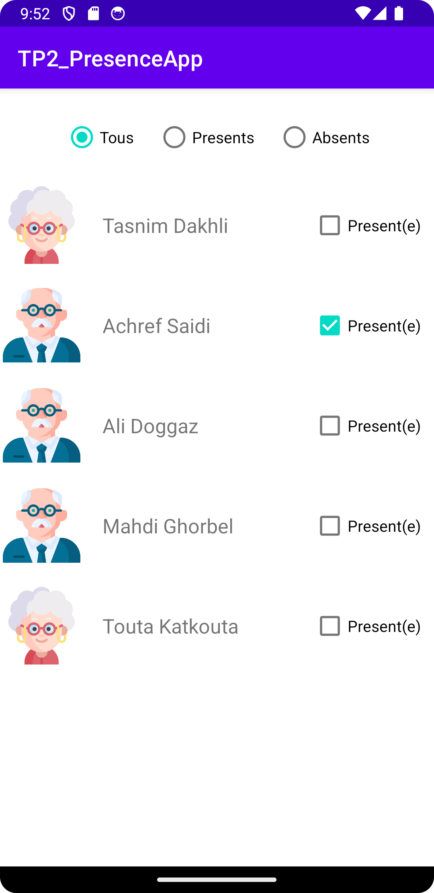

# Student Attendance Tracker

This Git repository contains a simple student attendance tracker with the following functions:

## 1. View Student Status (Absent - Present)

- To view the status of each student, use the checkbox feature.
- The interface provides a clear indication of whether a student is absent or present.

### Screenshot:

## 2. Change Student Status

- Easily change the status of a student from absent to present or vice versa.
- This functionality allows for quick updates to reflect the accurate attendance status.

### Screenshot:

## 3. Filter the List by Status (Absent - Present)

- Use the filter option to display a list of students based on their attendance status.
- This feature helps in efficiently managing and analyzing attendance data.

### Screenshot:

